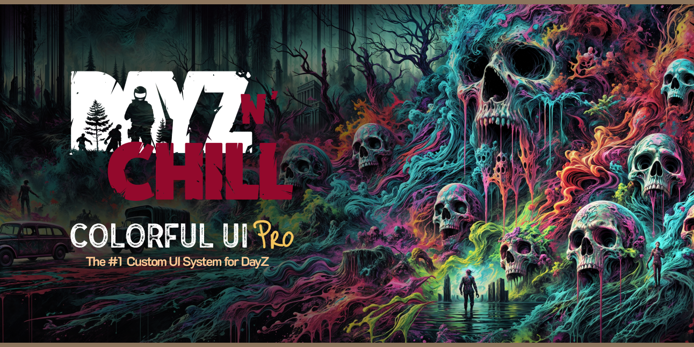

# Colorful UI Pro



## Features
- Fully Responsive Design (UHD & Ultrawide Supported)
- Loading Screen with Synced BG Images & Tips
- Main Menu with Static BG Image and Custom Music
- Modified layout on all Default Layouts
- Easily Editable Layout Files with Prefab Elements
- Simple Configuration
- Customize EVERY ELEMENT INDIVIDUALLY
- Death Screen
- NO MOD DEPENDENCIES

# Installation Guide

## Step 1 — Install required tools

- [Git](https://git-scm.com/)
- [Git LFS](https://git-lfs.github.com/)
- DayZ (Steam)
- DayZ Tools (Steam, free)
- DayZ Server (Steam, free)

## Step 2 — Use this template

- Go to https://github.com/DayZ-n-Chill/Colorful-UI-Pro
- Click the green **`Use this template`** → **`Create a new repository`**
- Name your new repo, click **`Create repository from template`**

## Step 3 — Clone YOUR new repo

Clone to a project drive, NOT your `P:\` drive:

```sh
git clone https://github.com/<your-username>/<your-repo>.git
```

## Step 4 — Mount the P drive

Open DayZ Tools once to mount `P:\`, or run:

```powershell
subst P: "C:\Program Files (x86)\Steam\steamapps\common\DayZ Tools\Bin\Work"
```

## Step 5 — Create the project junction

Replace `<repo-path>` with the path you cloned to in Step 3:

```powershell
New-Item -ItemType Junction -Path "P:\Colorful-UI" -Target "<repo-path>\Colorful-UI"
```

## Step 6 — Edit your UI

Open `Colorful-UI\Scripts\3_Game\Config\Settings.c` and edit:

- `class Branding` — your logo path
- `class CustomURL` — your website / priority queue / custom link
- `class SocialURL` — Discord / Facebook / Twitter / Reddit / Youtube (set to `"#"` to hide a button)
- `SERVER_IP` / `SERVER_PORT`
- Feature flags: `StartMainMenu`, `NoHints`, `UseImagesets`, `LoadVideo`, `EnableMenuVideo`, `EnableOptionsVideo`, `VideoDeathScreens`

Other edit points:

- `Colorful-UI\Scripts\Data\hints.json` — loading-screen hints
- `Colorful-UI\GUI\sounds\MainMenu\` — drop your `.ogg` files here, update `CfgSoundShaders` in `Colorful-UI\Scripts\config.cpp`
- `Colorful-UI\GUI\textures\Shared\` — your logo `.edds`

To edit in Workbench: open `Colorful-UI\Workbench\dayz.gproj`.

## Step 7 — Build the PBOs

```powershell
$ab  = 'C:\Program Files (x86)\Steam\steamapps\common\DayZ Tools\Bin\AddonBuilder\AddonBuilder.exe'
$inc = "$env:USERPROFILE\.claude\skills\dayz-build-pbo\include.lst"
$out = 'P:\Mods\@Colorful-UI\Addons'

Remove-Item -Recurse -Force 'P:\temp\Colorful-UI' -ErrorAction SilentlyContinue

& $ab 'P:\Colorful-UI\GUI'     $out '-prefix=Colorful-UI\GUI'     '-temp=P:\temp\Colorful-UI\GUI'     "-include=$inc" -clear
& $ab 'P:\Colorful-UI\Scripts' $out '-prefix=Colorful-UI\Scripts' '-temp=P:\temp\Colorful-UI\Scripts' "-include=$inc"
```

Output:

```
P:\Mods\@Colorful-UI\Addons\GUI.pbo
P:\Mods\@Colorful-UI\Addons\Scripts.pbo
```

## Step 8 — Test on a local server

Server:

```powershell
& 'C:\Program Files (x86)\Steam\steamapps\common\DayZ Server\DayZDiag_x64.exe' -server -mod=@Colorful-UI -config=serverDZ.cfg
```

Client:

```powershell
& 'C:\Program Files (x86)\Steam\steamapps\common\DayZ\DayZDiag_x64.exe' -mod=@Colorful-UI -connect=127.0.0.1 -port=2302
```

## Step 9 — Deploy to a live server

1. Copy `P:\Mods\@Colorful-UI\` to your server root.
2. Copy `@Colorful-UI\Keys\*.bikey` to the server's `keys\` folder.
3. Add `-mod=@Colorful-UI` to your server startup line.
4. Players must have the same `@Colorful-UI` client-side.

# License

[CC BY-NC 4.0](LICENSE.md) — Attribution-NonCommercial.
